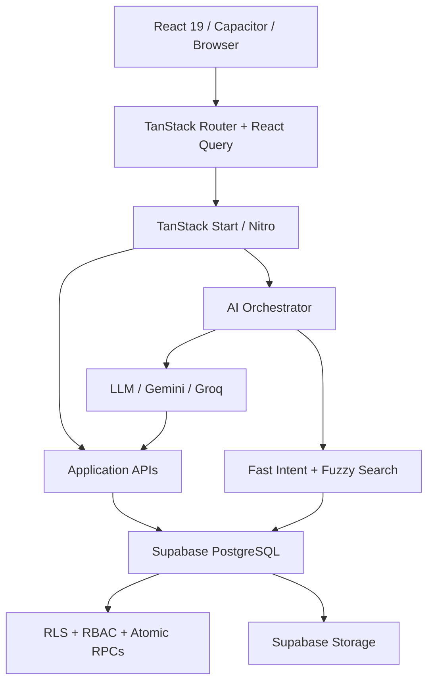

[README (1).md](https://github.com/user-attachments/files/31860192/README.1.md)
# Apna Khata

> **Modern POS, Inventory, Khata & AI-powered Shop Management for Automobile Spare Parts Businesses**

Apna Khata is a mobile-first, full-stack shop management platform built for Indian automobile spare-parts retailers, workshops, garages, and small-to-medium distributors.

It brings **counter billing, digital Khata, customer credit tracking, inventory, purchases, Short Maal, team management, reports, WhatsApp sharing, audio feedback, and AI assistance** into one practical workflow.

**Primary Product:** Apna Khata  
**Technology Attribution:** Powered by Zashly  
**Android Package:** `com.zashly.bharatautoparts`

---

## ✨ Highlights

- 🧾 Fast POS billing for busy counters
- 📒 Digital Khata with customer credit/debit tracking
- 💰 Cash, UPI, Card and Khata payments
- 📦 Inventory with stock and low-stock monitoring
- 🔎 Typo-tolerant product and customer search
- 🛒 Purchases and supplier stock-in
- 📝 **Short Maal** procurement/reminder notebook
- 👥 Multi-user shops with Owner, Manager and Staff roles
- 🔐 Supabase Auth + PostgreSQL RLS + RBAC
- 🤖 AI Assistant with Hindi, Hinglish and English support
- ⚡ Fast-path AI queries for common shop operations
- 🧠 LLM-powered conversational queries
- 🔌 MCP support for external AI clients
- 🔊 Context-aware business sound feedback
- 📱 Capacitor Android application
- 📲 WhatsApp invoice and payment-reminder sharing
- 📄 PDF invoices and customer statements
- 📊 Management reports and visual analytics
- 📤 CSV/Excel exports
- 🏪 Multi-tenant shop isolation

---

## 🎯 Why Apna Khata?

Traditional spare-parts shops often rely on paper Khata books, memory, spreadsheets, and disconnected billing/inventory tools.

Apna Khata is designed around the real workflow of a shopkeeper:

**Sell → Record payment → Track Khata → Monitor stock → Remember shortages → Purchase stock → Review business**

It focuses on speed and clarity instead of turning a small shop into a complicated ERP.

### Problems it addresses

- Forgotten customer dues and manual Khata mistakes
- Slow billing during busy hours
- Poor visibility into stock and purchase cost
- Forgotten or duplicated shortage/reorder requests
- Difficulty safely sharing one shop between multiple users
- Lack of a single place for daily business insights

---

## 👥 Who Is It For?

- Automobile spare-parts retailers
- Two-wheeler, three-wheeler and four-wheeler parts shops
- Automobile workshops and garages
- Shop owners and managers
- Billing/counter staff
- Wholesalers and distributors

---

# 🚀 Core Features

## 🧾 POS & Counter Billing

Designed for fast counter operations.

### Features

- Rapid product search and selection
- Manual/custom non-catalog items
- Real-time stock validation
- Out-of-stock warnings
- Cash payment
- UPI / QR payment
- Card payment
- Khata / Udhar payment
- Split and partial payments
- Discounts
- Server-side cost and profit calculations
- WhatsApp receipt sharing
- PDF invoices
- Standard and 80mm thermal receipt formatting

### Payment flow

```text
Customer purchase
      ↓
Select products
      ↓
Apply discount
      ↓
Choose payment mode
      ↓
Cash / UPI / Card / Khata
      ↓
Create invoice
      ↓
Update stock
      ↓
Update customer ledger
```

---

## 📒 Digital Khata

A dedicated customer credit and ledger system.

### Features

- Customer balances
- Credit / Udhar entries
- Payment received entries
- Running balance
- Due Today
- Pending Dues
- Advance Balance
- Payment due dates
- Receipt attachments
- WhatsApp payment reminders
- Customer statements
- Date-range filtering
- PDF statement generation

### Simple terminology

| Shop term | System meaning |
|---|---|
| Maal Diya | Credit given |
| Paisa Mila | Payment received |
| Hisab | Customer ledger/account |
| Udhar | Outstanding credit |
| Advance | Positive customer balance |

---

## 👤 Customer Management

Customers and Khata are intentionally separated.

### Customers

- Customer directory
- Search by name
- Search by mobile number
- Search by vehicle number
- Customer profile
- Address/details
- Notes
- Outstanding summary
- Transaction history
- Call / WhatsApp actions where supported
- Edit customer
- Safe deletion/archive flow

### Customer detail

A customer profile can show:

```text
Customer
Phone
Vehicle
Outstanding
Last activity
Invoices
Recent transactions
```

### Customer vs Khata

```text
CUSTOMERS
    ↓
Who is the customer?
Profile / contact / details

KHATA
    ↓
What money is owed or received?
Credit / debit / payment / ledger
```

---

## 📦 Inventory Management

Built specifically for automobile spare parts.

### Product information

- Product name
- Part number
- Category
- Brand
- Variant
- Shelf location
- Purchase price
- Selling price
- Stock quantity
- Low-stock threshold
- Notes
- Active/inactive state

### Search

Database fuzzy search supports typo-tolerant matching across product information, including:

- Name
- Brand
- Part number
- Category

---

## 📝 Short Maal

**Short Maal** is a dedicated shortage/procurement notebook.

It answers:

> “Kaunsa maal next purchase mein lana hai?”

### Features

- Add a shortage item
- Link it to an existing product
- Free-form non-catalog item support
- Required quantity
- Supplier notes
- Priority levels:
  - Urgent
  - High
  - Medium
  - Low
- Status:
  - Pending
  - Purchased
  - Cancelled

### Important distinction

**Low Stock ≠ Short Maal**

```text
Low Stock
    ↓
Automatically detected from inventory thresholds

Short Maal
    ↓
Manually maintained "maal lana hai" list
```

---

## 🛒 Purchases & Stock-In

Manage supplier purchases and inventory replenishment.

### Features

- Supplier management
- Supplier contact details
- Purchase bills
- Bill number
- Bill date
- Payment method
- Supplier dues
- Multi-item stock-in
- Automatic stock updates
- Purchase cost tracking
- Supplier purchase history

---

## 📊 Management & Analytics

The main Dashboard stays focused on daily work, while **Management** acts as the business overview.

### Management can include

- Today's sales
- Monthly sales
- Collections
- Outstanding
- Profit
- Revenue/cost view
- Inventory health
- Low-stock products
- Out-of-stock products
- Short Maal summary
- Top debtors
- Top customers
- Best-selling products
- Supplier spend
- Purchases
- Financial reports
- Business trends

### Time ranges

- 30 days
- 90 days
- 365 days
- Date-range filtering where supported

### Visualization

Interactive charts are built with **Recharts**.

---

## 👥 Team & Multi-Owner Shops

A single physical shop can have multiple user accounts.

Example:

```text
Apna Khata
├── Owner 1
├── Owner 2
├── Manager
└── Staff
```

Every user has a separate authentication identity, but authorized users can belong to the same `shop_id`.

### Roles

- `owner`
- `manager`
- `staff`

### Invitation flow

```text
Owner
  ↓
Invite Member
  ↓
Enter phone + role
  ↓
Generate Join Code
  ↓
Share code
  ↓
User selects "Join Shop"
  ↓
Phone + Join Code
  ↓
Validate invitation
  ↓
Join existing shop
```

Join codes are generated through the database invitation workflow.

---

## 🔐 Security & Multi-Tenant Isolation

Security is part of the architecture rather than an afterthought.

### Database security

- PostgreSQL on Supabase
- Row Level Security (RLS)
- Shop-scoped data isolation
- `public.current_shop_id()` tenant boundary
- Role-based access control
- Server-side authorization for sensitive operations

### Important security rules

The client/AI must not be trusted to choose an arbitrary:

- `shop_id`
- `user_id`
- role

The authenticated identity and database authorization model determine access.

### Financial safety

The application uses:

- Atomic database routines
- Append-only financial ledger behavior
- Idempotency guards
- Protected financial deletion paths
- Confirmation/security checks for sensitive actions

---

# 🤖 AI Shop Assistant

Apna Khata includes a shop-focused conversational AI system.

## Languages

The assistant is designed to understand:

- Hindi
- Hinglish
- English

Examples:

```text
"servo oil ka price kya hai"

"servo ka stock kitna hai"

"Rahul ka hisab bata"

"show Rahul balance"
```

---

## ⚡ Dual-Path AI Architecture

### FAST Path

For common operational queries:

```text
User Query
    ↓
Regex / tokenizer
    ↓
Intent detection
    ↓
Fuzzy entity matching
    ↓
PostgreSQL query
    ↓
Fast response
```

This path is designed for very low latency operational lookups.

### LLM Path

For more conversational requests:

```text
User
 ↓
Natural Language Understanding
 ↓
Gemini / Groq / compatible provider
 ↓
Tool selection
 ↓
Business data
 ↓
Natural-language response
```

---

## 🧰 AI Tools

The platform includes tool-oriented infrastructure for operations such as:

- Product lookup
- Customer lookup
- Sales summary
- Recent invoices

The architecture is designed so the AI reasons about the request while business data remains authoritative in the backend/database.

---

## 🔌 MCP Support

The application exposes Model Context Protocol support for external AI clients.

Relevant MCP capabilities include:

- Product tools
- Customer tools
- Recent invoice tools
- Sales summary tools

This allows the shop backend to expose controlled business capabilities to compatible AI systems.

---

# 🔊 Sound & Feedback System

Apna Khata includes a centralized sound-feedback system.

Sounds are intended to be subtle and business-focused rather than noisy.

### Example events

- Payment received
- Bill created
- Stock updated
- Successful save
- Important warning
- Error/validation failure
- Completion events

### Design principle

```text
Important business event
        ↓
Successful backend result
        ↓
Visual confirmation
        ↓
Subtle sound
```

Navigation, typing, scrolling and other minor UI actions remain silent.

Sound effects can be enabled or muted from Preferences.

---

# 📱 Android App

Apna Khata is integrated with **Capacitor** for native Android packaging.

### App identity

```text
Application Name:
Apna Khata

Android Package:
com.zashly.bharatautoparts
```

### Native capabilities currently configured

- Capacitor Android
- Keyboard handling
- Splash screen
- Status bar
- Network detection

The application is designed to keep web and native workflows aligned.

---

# 🧱 Architecture



### Layer responsibilities

| Layer | Responsibility |
|---|---|
| React / Capacitor | User interface and mobile shell |
| TanStack Router | File-based navigation |
| React Query | Client caching and state synchronization |
| TanStack Start / Nitro | Server-side application and API layer |
| AI Orchestrator | Intent routing and tool execution |
| Supabase | PostgreSQL, Auth, Storage, RLS |
| PostgreSQL RPCs | Atomic business operations |
| Capacitor | Native Android bridge |

---

# 🗂️ Project Structure

```text
shop/
├── android/                     # Capacitor Android project
├── public/                      # Static assets, icons, sounds
├── scripts/                     # Audit/test/verification scripts
├── src/
│   ├── components/              # Shared UI components
│   │   ├── ai-elements/         # AI UI components
│   │   └── ui/                  # Radix/Shadcn UI primitives
│   ├── hooks/                   # Custom React hooks
│   ├── integrations/
│   │   └── supabase/             # Supabase clients/auth
│   ├── lib/
│   │   ├── ai/                  # AI orchestration/search/permissions
│   │   ├── domain/              # Domain services
│   │   ├── mcp/                 # MCP tools
│   │   ├── db.ts                # DB/types wrapper
│   │   ├── format.ts            # Currency/date/phone formatting
│   │   └── sounds.ts             # Sound manager
│   └── routes/
│       ├── auth.tsx
│       ├── api/
│       └── _authenticated/
│           ├── dashboard.tsx
│           ├── billing.tsx
│           ├── customers.index.tsx
│           ├── customers.$id.tsx
│           ├── khata.index.tsx
│           ├── khata.$id.tsx
│           ├── products.tsx
│           ├── purchases.tsx
│           ├── short-maal.tsx
│           ├── management.tsx
│           ├── team.tsx
│           ├── assistant.tsx
│           └── settings.*
├── supabase/
│   └── migrations/              # Database migrations
├── capacitor.config.ts
├── package.json
├── tsconfig.json
├── vite.config.ts
└── eslint.config.js
```

---

# 🗃️ Database

The project uses Supabase PostgreSQL with a shop-scoped multi-tenant data model.

## Core tables

| Table | Purpose |
|---|---|
| `profiles` | User profile + shop membership |
| `user_roles` | User role within a shop |
| `products` | Spare-parts inventory |
| `customers` | Customer directory and balance cache |
| `invoices` | Sales invoices |
| `invoice_items` | Invoice line items |
| `ledger_transactions` | Append-only customer ledger |
| `payments` | Customer payment records |
| `inventory_movements` | Inventory movement history |
| `short_maals` | Shortage/procurement list |
| `suppliers` | Supplier records |
| `purchases` | Purchase invoices |
| `purchase_items` | Purchase line items |
| `shop_invitations` | Team invitations |
| `idempotent_requests` | Duplicate-operation protection |
| `audit_log` | Audit/security trail |
| `ai_conversations` | AI conversation records |
| `ai_telemetry_logs` | AI execution telemetry |
| `product_aliases` | Alternate/slang product names |
| `ledger_entries` | Legacy compatibility ledger table |

---

# 🔒 Database & Business Integrity

The system uses PostgreSQL functions/RPCs for critical transactional operations.

Examples include:

```text
create_sale()
receive_payment()
create_manual_ledger_entry()
update_manual_ledger_entry()
delete_manual_ledger_entry()

invite_user()
generate_join_code()
validate_join_code()
accept_invitation()
remove_member()

search_products_fuzzy()
search_customers_fuzzy()
```

The database also contains triggers for important synchronization and integrity tasks such as:

- `handle_new_user`
- `touch_updated_at`
- stock decrement on sales
- stock increment on purchases
- invoice cost snapshots
- invoice total recalculation

---

# 🔑 Authentication

The application uses Supabase Auth with a phone-oriented shop workflow.

The documented application flow is:

```text
10-digit mobile number
        +
4–6 digit PIN
        ↓
Internal Supabase credential
        ↓
Session
        ↓
Shop-scoped application
```

### Create Shop

```text
Phone + PIN + Shop information
        ↓
Supabase Auth signup
        ↓
Database user trigger
        ↓
New shop
        ↓
Owner profile
```

### Join Shop

```text
Join Code + Phone + Name + PIN
        ↓
Validate invitation
        ↓
Existing account → Sign In
New account → Sign Up
        ↓
Link to invited shop
        ↓
Assign invited role
```

---

# 💻 Tech Stack

| Area | Technology |
|---|---|
| Frontend | React 19 + TypeScript |
| Framework | TanStack Start |
| Routing | TanStack Router |
| State/Cache | TanStack React Query |
| Styling | Tailwind CSS v4 + CSS |
| UI | Radix UI / Shadcn |
| Animations | Framer Motion |
| Icons | Lucide React |
| Charts | Recharts |
| PDF | jsPDF |
| Backend | TanStack Start / Nitro |
| Database | Supabase PostgreSQL |
| Auth | Supabase Auth |
| Storage | Supabase Storage |
| AI | Vercel AI SDK |
| AI Providers | Google Gemini, Groq, OpenAI-compatible endpoints |
| Search | PostgreSQL `pg_trgm` + fuzzy search |
| Mobile | Capacitor |
| Android | Capacitor Android |
| Build | Vite |
| Quality | ESLint + Prettier |
| Hosting | Vercel |

---

# ⚙️ Local Development

## Prerequisites

- Node.js 20+
- npm or Bun
- Supabase CLI
- Android Studio + JDK for Android builds

## Installation

```bash
git clone https://github.com/YOUR_USERNAME/bharat-auto-parts.git
cd bharat-auto-parts

npm install
```

Create your local environment file:

```bash
cp .env.example .env.local
```

Then configure the required credentials.

---

# 🔐 Environment Variables

Use `.env.example` as the authoritative template for the current repository.

Typical configuration includes:

```env
SUPABASE_URL=
SUPABASE_PROJECT_ID=
SUPABASE_PUBLISHABLE_KEY=
SUPABASE_SERVICE_ROLE_KEY=

VITE_SUPABASE_URL=
VITE_SUPABASE_PROJECT_ID=
VITE_SUPABASE_PUBLISHABLE_KEY=

GROQ_API_KEY=
GEMINI_API_KEY=

N8N_API_KEY=
N8N_DEFAULT_SHOP_ID=
```

> **Never commit real secrets.**
>
> Service-role credentials and other private keys must remain server-side.

---

# 🛠️ Development Commands

```bash
# Start development server
npm run dev

# Run lint
npm run lint

# Format
npm run format

# Production build
npm run build

# Development build
npm run build:dev

# Preview production build
npm run preview
```

---

# 📱 Android / Capacitor

## Build web assets

```bash
npm run build
```

## Sync with Android

```bash
npx cap sync android
```

## Open Android Studio

```bash
npx cap open android
```

## Build Debug APK

```bash
cd android
./gradlew assembleDebug
```

On Windows:

```powershell
cd android
.\gradlew assembleDebug
```

APK output:

```text
android/app/build/outputs/apk/debug/app-debug.apk
```

## Release build

```bash
cd android
./gradlew assembleRelease
```

Release builds require proper Android signing configuration.

---

# 🌐 Deployment

## Web

The web application is deployed through Vercel.

Typical flow:

```text
Git push
   ↓
Vercel build
   ↓
Production deployment
```

## Supabase

Database migrations are managed through the Supabase CLI:

```bash
npx supabase link --project-ref YOUR_PROJECT_REF
npx supabase db push --linked
```

---

# 🧪 Testing

Important testing areas include:

### Authentication

- Sign in
- Create Shop
- Join Shop
- Invalid join code
- Expired invitation
- Role assignment
- Logout/session persistence

### Billing

- Product search
- Stock validation
- Discount
- Cash
- UPI
- Card
- Khata
- Split payment
- Invoice creation

### Khata

- Credit entry
- Payment entry
- Balance recalculation
- Due dates
- Statement generation

### Inventory

- Product creation
- Product update
- Stock adjustment
- Stock-in
- Low-stock conditions

### Multi-user

```text
Owner 1
   +
Owner 2
   ↓
Same shop_id
   ↓
Same business data
```

### AI

- Hindi
- Hinglish
- English
- Product lookup
- Customer lookup
- Sales summary
- Invoice lookup

---

# 📸 Screenshots

Suggested README showcase:

```text
docs/screenshots/
├── dashboard.png
├── billing.png
├── customers.png
├── customer-detail.png
├── khata.png
├── ledger.png
├── inventory.png
├── short-maal.png
├── management.png
├── team.png
├── ai-assistant.png
└── android-app.png
```

Add screenshots here and reference them like:

```markdown

```

---

# 🗺️ Roadmap

Potential future improvements include:

- 📶 Offline-first synchronization
- 📷 Barcode / QR scanning
- 🏪 Multi-store inventory and branch transfers
- 🧾 GST / E-Way Bill workflows
- 🗣️ Voice-activated Hindi shop assistant
- 📲 More native Android integrations
- 🔔 Richer push notification workflows
- 🧠 Expanded AI business tools
- 📄 PDF-based bulk price update workflows

---

# 🤝 Contributing

Contributions are welcome.

Suggested workflow:

```text
Fork
  ↓
Create feature branch
  ↓
Implement
  ↓
Run lint + build + tests
  ↓
Open Pull Request
```

Example:

```bash
git checkout -b feature/your-feature
git add .
git commit -m "Add your feature"
git push origin feature/your-feature
```

Please keep security, tenant isolation, and existing business logic intact.

---

# 🔐 Security Principles

When contributing, do not:

- expose Supabase service-role keys
- commit `.env.local`
- trust client-provided `shop_id`
- bypass RLS
- modify financial data without validation
- create unrestricted SQL execution paths for AI
- expose customer financial information publicly

Critical business operations should remain protected by the existing authorization and database integrity model.

---

# 📈 Project Snapshot

Based on the current repository analysis:

- ~31 frontend/system routes
- ~61 UI components
- 5 domain services
- 20 PostgreSQL tables
- 27 database functions/triggers/security functions
- 25 migration scripts
- 7 configured Capacitor plugins

---

# 🏆 Product Philosophy

Apna Khata follows a simple principle:

> **Make complex shop management feel simple.**

The application keeps each part of the workflow focused:

```text
HOME
    Daily work

MANAGEMENT
    Business overview & analytics

CUSTOMERS
    Customer directory & profiles

KHATA
    Credit, payment & ledger

BILL
    Sales & billing

INVENTORY
    Products & stock

SHORT MAAL
    What needs to be brought

PURCHASES
    Supplier stock-in

TEAM
    Shop users & permissions

AI
    Intelligent shop assistant

PROFILE
    Account & settings
```

---

# 🧑‍💻 Built With

**Apna Khata** is powered by a modern TypeScript stack combining React, TanStack Start, Supabase, PostgreSQL, AI tooling, and Capacitor.

**Powered by Zashly**

---

## 📄 License

Add your project's actual license here once it is confirmed in the repository.

For example:

```text
MIT License
```

Do **not** claim MIT unless an actual `LICENSE` file or confirmed project licensing exists.

---

## ⭐ Support the Project

If this project is useful to you:

- ⭐ Star the repository
- 🐛 Report issues
- 💡 Suggest features
- 🔧 Contribute improvements

---

**Apna Khata — a practical digital operating system for automobile spare-parts businesses.**
